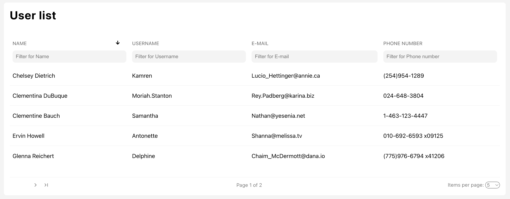

# Task Users Table

See the live version - <a href="https://yakksiek.github.io/task-userstable" target="_blank">User table</a>.

This project is a user table interface with features such as fetching user data from an API, filtering, sorting, and pagination. The project uses technologies like React, Redux Toolkit, Styled Components, and TypeScript.

## Features

### 1. Fetching Users

-   The user data is fetched from a remote API using `axios`.
-   This fetching process is managed by Redux Toolkit’s `createAsyncThunk` to handle asynchronous requests within the Redux store.
-   A loading spinner is displayed while the data is being fetched, and an error message is shown if the request fails.

### 2. Redux State Management

-   The project uses Redux Toolkit to manage the state of the users, sorting options, filtering, pagination, and more.

### 3. Sorting

-   Users can sort the table by different columns such as `Name`, `Username`, `E-mail`, or `Phone Number`.
-   The sorting feature supports ascending and descending orders.

### 4. Filtering

-   The table allows users to filter by `Name`, `Username`, `E-mail`, and `Phone Number` through input fields provided in the table header.
-   The filtering is done locally, meaning that once the user data is fetched, the data is filtered on the client side for optimal performance.

### 5. Pagination

-   The table supports pagination, allowing users to specify how many users they want to see per page.
-   Users can navigate through pages, and the pagination state is stored in Redux to persist the current page and items per page settings.

### 6. Styled Components

-   The UI is styled using Styled Components, allowing scoped and dynamic styling.
-   It also leverages CSS variables for consistent theming and maintainable styles.

### Technologies Used


## Installation

1. Clone the repository:

    ```bash
    git clone https://github.com/yakksiek/task-users-table.git
    ```

2. Navigate into the project directory:

    ```bash
    cd task-users-table
    ```

3. Install the dependencies:

    ```bash
    npm install
    ```

4. Run the development server:

    ```bash
    npm run dev
    ```

## Possible future features

-   **writing tests**

&nbsp;

## Feel free to contact me

Find me on [LinkedIn ](https://www.linkedin.com/in/marcin-kulbicki-426817a4/) or [Instagram](https://www.instagram.com/yakksiek/)

&nbsp;
